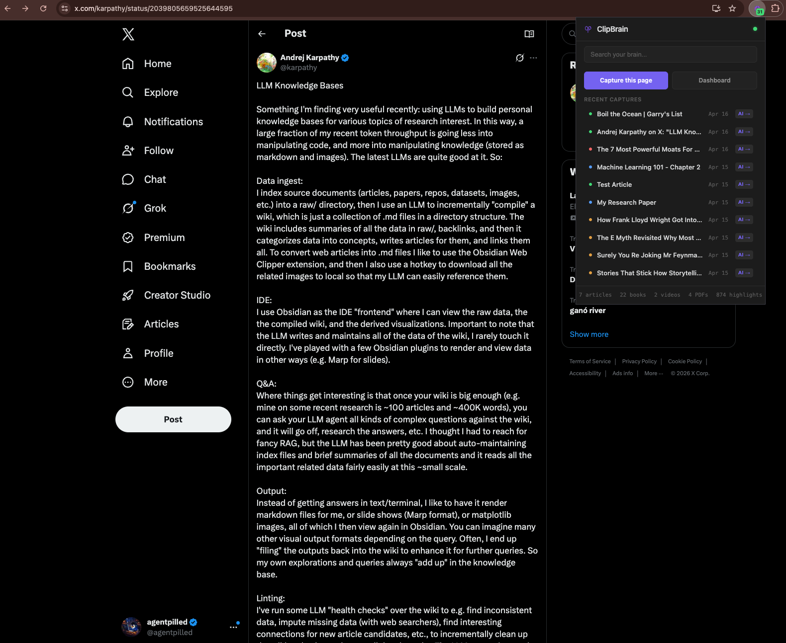
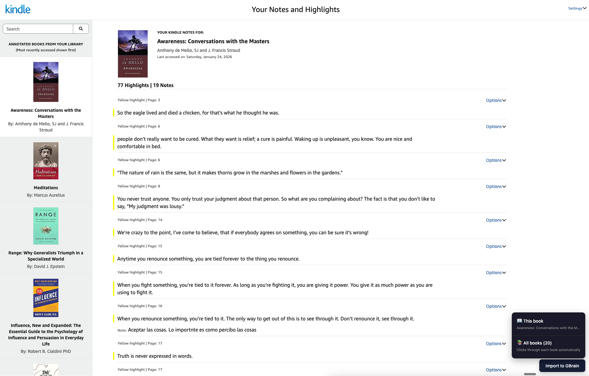
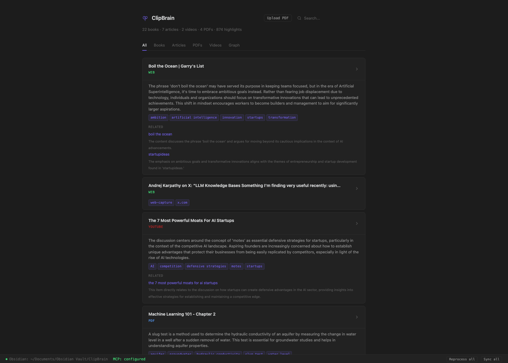

# ClipBrain

**Your AI doesn't know what you've read. ClipBrain fixes that.**

An open source Chrome extension that captures everything you read and makes it searchable by your AI. Built on top of [@garrytan](https://twitter.com/garrytan)'s [GBrain](https://github.com/nichochar/gbrain) knowledge engine. Inspired by [@karpathy](https://twitter.com/karpathy)'s [post about building personal knowledge bases with LLMs](https://x.com/karpathy/status/20398050659526644595).

One shortcut: **Cmd+Shift+S**. Your AI never starts from zero again.

## See it in action

### Clip any page

Press **Cmd+Shift+S** on any page. The extension captures the content, AI-processes it, and stores it locally. Your AI can search it instantly.



### Import all your Kindle highlights

Go to [read.amazon.com/notebook](https://read.amazon.com/notebook) and click **Import to ClipBrain**. It clicks through every book, extracts every highlight and note. 20 books, 871 highlights, 30 seconds.



### AI summaries, tags, and connections

Every capture gets post-processed: a 2-3 sentence summary, semantic tags, and automatic connections to your other captures. Your AI doesn't just store things. It thinks.



## Get started

You need [Bun](https://bun.sh) and Chrome.

```bash
git clone https://github.com/agentpilled/clipbrain
cd clipbrain
./setup.sh
```

This single command installs dependencies, builds the knowledge engine, creates a local database, auto-configures your AI tools, connects to Obsidian (if installed), and starts a background service.

Then load the Chrome extension:

1. Go to `chrome://extensions`
2. Turn on **Developer mode** (top right)
3. Click **Load unpacked** and select the `clipbrain` folder

Done. Press **Cmd+Shift+S** on any page.

## What you can capture

| Source | How | What gets stored |
|--------|-----|-----------------|
| **Web articles** | Cmd+Shift+S on any page | Full article text via Readability.js |
| **Tweets** | Cmd+Shift+S on any tweet | Tweet content + thread |
| **Kindle highlights** | One-click import from read.amazon.com | All highlights, notes, and book metadata |
| **YouTube videos** | Cmd+Shift+S on any video | Full transcript with timestamps |
| **PDFs** | Drag onto dashboard or upload | Extracted text, indexed and searchable |

## Using with your AI

After setup, your AI already has access via MCP. Just talk naturally:

- *"What did I highlight in Awareness by Anthony de Mello?"*
- *"Find my notes about storytelling"*
- *"What did that YouTube video say about AI moats?"*
- *"Summarize what I've read about decision-making"*

Works with **Claude Code**, **OpenClaw**, **Claude Desktop**, **Cursor**, and any MCP-compatible tool.

## Dashboard

Open **http://localhost:19285** to browse your knowledge base.

- Filter by books, articles, PDFs, videos
- Search across everything
- View AI summaries, tags, and connections
- Explore the knowledge graph
- Upload PDFs via drag and drop

## Obsidian sync

If you use Obsidian, ClipBrain auto-syncs captures as markdown to your vault. Each capture becomes a `.md` file with frontmatter, wikilinks, and AI summaries. Auto-detected during setup.

## How it works

```
  You browse & read                        You ask your AI
        |                                        |
  Cmd+Shift+S or                          "What did I read
  Kindle import                            about X?"
        |                                        |
        v                                        v
  +-----------+    +--------------+    +--------------+
  |  Chrome   |--->|  Capture     |    |  MCP Server  |
  |  Extension|    |  Server      |    |  (auto)      |
  +-----------+    +------+-------+    +------+-------+
                          |                   |
                          v                   v
                   +------------------------------+
                   |  Local database (pgvector)    |
                   |  + Obsidian vault (optional)  |
                   +------------------------------+
```

Everything runs locally. No data leaves your machine except for generating embeddings (OpenAI API).

## Requirements

- [Bun](https://bun.sh)
- Chrome or Chromium
- `OPENAI_API_KEY` environment variable (for embeddings and AI processing)
- [yt-dlp](https://github.com/yt-dlp/yt-dlp) (optional, for YouTube transcripts)
- Obsidian (optional, for vault sync)

## Credits

- **[GBrain](https://github.com/nichochar/gbrain)** by [@garrytan](https://twitter.com/garrytan) — the knowledge engine powering ClipBrain (pgvector, hybrid search, MCP)
- **[@karpathy](https://twitter.com/karpathy)** — his [post about LLM knowledge bases](https://x.com/karpathy/status/20398050659526644595) described the exact system I wanted to build
- Built with **[Claude Code](https://claude.ai/claude-code)**
